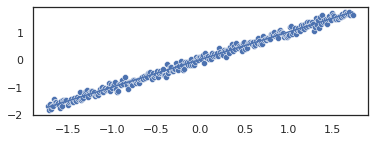
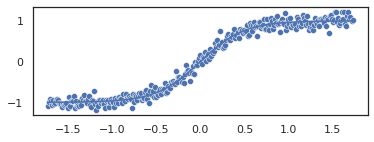
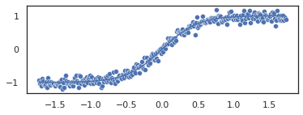
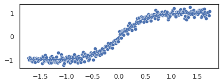
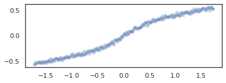

# An example of model non-linearity in the presence of a linear predictor.
Notebook available on-line: https://github.com/spisakt/mlconfound_manuscript/tree/main/simulated/normality_and_linearity_violation.ipynb


```python
import numpy as np
import seaborn as sns
import matplotlib.pyplot as plt
from sklearn.linear_model import Ridge
sns.set(rc={"figure.figsize":(6, 2)})
sns.set_style("white")
```

### Five features: one linear, four sigmoid


```python
n=300
p=5
rng = np.random.default_rng(42)
y = np.arange(n)
y = (y - y.mean())/y.std()

X_true = np.repeat(y, p).reshape(n,p)
for i in range(1,4):
    X_true[:,i] = np.tanh(X_true[:,i]*2)

X=X_true + rng.normal(0,0.1, (n,p))

for i in range(4):
    sns.lineplot(x=y, y=X_true[:,i])
    sns.scatterplot(x=y, y=X[:,i])
    plt.show()
```


    

    


    

    


    

    


    

    


### Model predictions **without** regularization


```python
model = Ridge(alpha=0)
model.fit(y=y, X=X)
yhat = model.predict(X)
sns.scatterplot(x=y, y=yhat, alpha=0.3)
#sns.lineplot(x=y, y=y, linestyle="--")
model.coef_
```


    array([ 0.47902429,  0.00946499,  0.07378478, -0.02828672,  0.47070535])


    

    


### Model predictions **with** regularization


```python
model = Ridge(alpha=2000)
model.fit(y=y, X=X)
yhat = model.predict(X)
sns.scatterplot(x=y, y=yhat, alpha=0.3)
#sns.lineplot(x=y, y=y, linestyle="--")
model.coef_
```


    array([0.09472368, 0.07472972, 0.07338482, 0.07440682, 0.09463765])


    

    


```python

```
